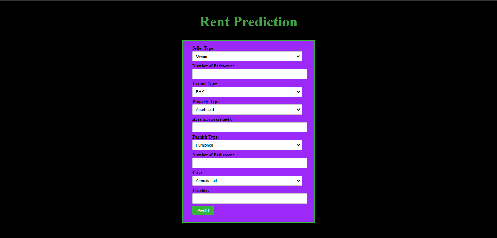
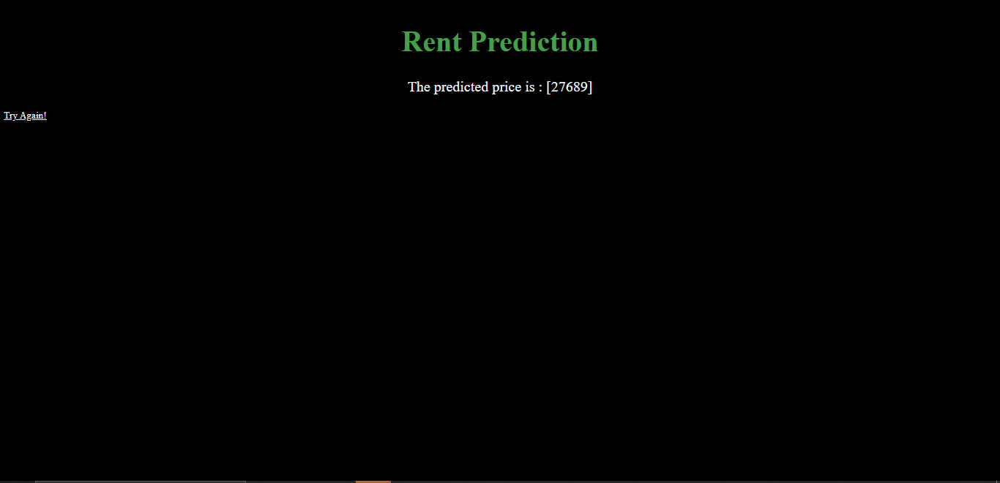

# Rent-Prediction

This is a Machine Learning Model which is trained on a dataset from Kaggle. The data contains informatikon about number of bedrooms, bathrooms, city, locality, furnish type etc.
The model uses XGBOOST Algorithm and has an accuracy of 90%(almost) .
The project is deployed using Flask.

## How to Run:-

Step 1: Download the code/ Fork this repo and make sure code is available on your system.

Step 2: Open file named app.py and run this python file, by default file will run on port=5500.

You will see something like this.

